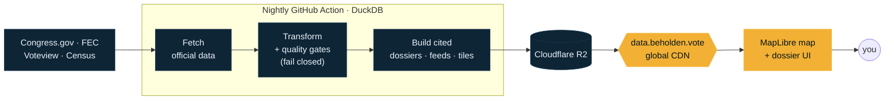

<p align="center">
  
</p>

<p align="center">
  <a href="https://beholden.vote"></a>
  &nbsp;
  
</p>

<p align="center">
  
  
  
  
  
</p>

---

## A political microscope, built on receipts

Click anywhere on the map and see **who represents that spot** — then open any of them into a
**fully-cited accountability dossier**: party, ideology, legislative record, campaign money,
and (soon) stock trades. Every number on screen links back to the official record it came from.
No spin, no scoring, no thumb on the scale — **the same treatment for every official, of every party.**

> **The twist:** there is no backend. A nightly robot reads official government data, refuses to
> publish anything it can't cite, and bakes the whole thing into static files on a global CDN.
> The map *is* the database. It costs about the price of a domain to run — and it's **[live now](https://beholden.vote).**

## What you can do today

| | |
|---|---|
| 🗺️ **Explore the map** | Every U.S. House district, colored by party, on a fast vector map. Toggle U.S. Senate and (coming) state chambers as layers. |
| 📍 **Find your reps** | Type an address, tap **"use my location,"** or just click — your representation stack opens instantly. |
| 📄 **Open a dossier** | Identity, tenure, **DW-NOMINATE ideology**, real sponsored / cosponsored / became-law counts with congress.gov links, and **FEC campaign finance** (raised · spent · cash on hand). |
| 🔎 **Trace every claim** | Each section carries a source stamp. Click it; land on the government record. |

**537 sitting members of Congress · 88,000+ bill sponsorships · live FEC totals · all cited.**

## How it works — the CDN *is* the database



No runtime server means nothing to hack, nothing to scale, nothing to meter — **user traffic never
touches a database or a paid API.** Popularity is nearly free (see [`docs/ARCHITECTURE.md`](docs/ARCHITECTURE.md)).

## The three rules that outrank everything

- **Provenance over polish** — every published fact carries a link to its official source. If we can't cite it, we don't show it.
- **Symmetric by construction** — identical sections, sourcing, and design for every official. The tool has no partisan lean.
- **Descriptive, not prescriptive** — we show the record and the receipts. You draw the conclusions.

## Under the hood

**Frontend** — React + **MapLibre GL** + **PMTiles** (byte-range reads straight from the CDN, no tile server), Space Grotesk + IBM Plex Mono, a "Public Record" civic-brutalist design system ([`web/DESIGN.md`](web/DESIGN.md)).
**Pipeline** — Python + **DuckDB**, an identity spine with fail-closed quality gates, publishing static JSON + PMTiles to **Cloudflare R2**, orchestrated by **GitHub Actions**.
**Geocoding** — a Cloudflare Pages Function proxies the official Census geocoder, so address lookup stays on our own infrastructure.

### Data sources — all public record

| Source | Provides |
|---|---|
| [Congress.gov](https://api.congress.gov) | Members, bills, sponsorships, legislative status |
| [unitedstates/congress-legislators](https://github.com/unitedstates/congress-legislators) | The identity crosswalk across every ID scheme |
| [Voteview](https://voteview.com) | DW-NOMINATE ideology from recorded votes |
| [FEC](https://api.open.fec.gov) | Campaign finance — raised, spent, cash on hand |
| [Census TIGER](https://www.census.gov/geographies/mapping-files.html) | District boundaries + address geocoding |

## Roadmap

- ✅ **Live** — the map, federal legislators, ideology, legislative record, FEC campaign finance, address + geolocation lookup, layer controls
- 🔜 **Next** — state legislators (OpenStates fills the state-chamber layers) · STOCK Act trades
- 🧭 **Later** — county & municipal officials · entity graph ("who's connected to whom") · public API

## Quickstart

```bash
make spike                              # reproduce the tile-density spike — no keys needed
cd web && npm install && npm run dev    # the frontend, against live data
pip install -e ./pipelines              # the ETL (needs Congress.gov + FEC keys to fetch)
make fetch transform build              # artifacts land in dist/data for inspection
```

## Docs

| Doc | What it covers |
|---|---|
| [`docs/PRD.md`](docs/PRD.md) | Product spec: principles, goals, dossier UX, phasing |
| [`docs/ARCHITECTURE.md`](docs/ARCHITECTURE.md) | The free-tier, zero-server design and scale-up path |
| [`docs/DATA-CONTRACTS.md`](docs/DATA-CONTRACTS.md) | Spine DDL, dossier JSON, tile + entity-graph contracts |
| [`docs/TICKETS-PHASE1.md`](docs/TICKETS-PHASE1.md) | The 12-week engineering breakdown |
| [`docs/SETUP.md`](docs/SETUP.md) | Zero to running: accounts, secrets, first pipeline run |
| [`AGENTS.md`](AGENTS.md) · [`web/DESIGN.md`](web/DESIGN.md) | Contributor + design-system guides |

<p align="center"><sub><b>Beholden</b> · power, on the public record · <a href="https://beholden.vote">beholden.vote</a></sub></p>
