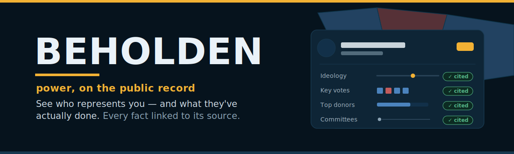
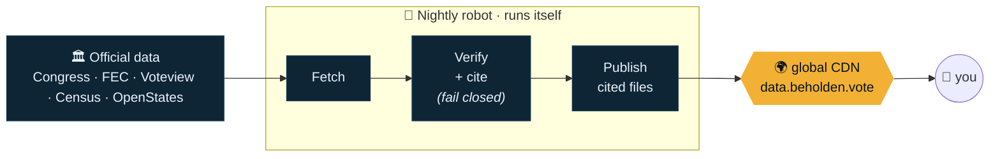

<p align="center">
  
</p>

<p align="center">
  <a href="https://beholden.vote"></a>
  &nbsp;
  
  &nbsp;
  
  &nbsp;
  <a href="LICENSE"></a>
</p>

<p align="center">
  <b>Beholden is a map of everyone who holds power over you — and a receipt for everything they do with it.</b><br>
  <sub>Click your neighborhood. Meet your representatives. See how they vote, who funds them, and where you can check it yourself.</sub>
</p>

---

## 🏛️ What is this, in one breath?

Most people can't name their state senator, let alone say how they voted last month. Beholden fixes that.
**Point at where you live and it shows you every official who represents that spot** — from the U.S. Senate down to
your statehouse — and opens each one into a plain-English profile of their record. **Every single fact links back
to the government document it came from.** No opinions, no scores, no side. Just the receipts.

> 🧾 **The promise:** if we can't show you the official source for a fact, we don't print the fact.

## ▶️ Try it in 10 seconds

<table>
<tr>
<td width="33%" align="center"><h3>1 · Find your spot</h3>Type your address, tap <b>“use my location,”</b> or just <b>click the map.</b><br/><br/></td>
<td width="33%" align="center"><h3>2 · Meet your reps</h3>Everyone who represents that point stacks up — <b>federal, state, local.</b><br/><br/></td>
<td width="33%" align="center"><h3>3 · Open the receipts</h3>Tap any name for a <b>fully-cited profile.</b> Tap any fact to jump to the source.</td>
</tr>
</table>

<p align="center"><b>👉 <a href="https://beholden.vote">Open the live map at beholden.vote</a></b> — no account, no sign-up, nothing to install.</p>

## 📄 What’s inside a profile

Open any member of Congress and here’s what you get — each row carrying a ✓ link to the official record:

| | | |
|---|---|---|
| 🧭 **Where they stand** | An ideology score built from their *own recorded votes* | *Voteview / DW-NOMINATE* |
| 🗳️ **Key votes** | The closest, most consequential votes they cast — with how they voted | *House & Senate roll calls* |
| 🤝 **Party agreement** | How often they side with their own party | *computed, formula published* |
| 🏛️ **Committees** | Every committee and subcommittee they sit on, and their role | *congress-legislators* |
| 💰 **Campaign money** | Raised · spent · cash on hand | *Federal Election Commission* |
| 🏢 **Top donors** | The biggest contributor groups behind them | *FEC itemized filings* |
| 📈 **Stock trades** | Links to their official financial-disclosure filings | *U.S. House Clerk* |
| 🕸️ **Connections** | Who they share committees, donors, and votes with | *deterministic, receipts on every link* |

And because none of this is worth much if you can’t check it, there’s a **[Methodology](https://beholden.vote/#methodology)**
page spelling out every formula in plain sight — and a **“how is this computed?”** link on the numbers themselves.

## 🗺️ The map itself

- **Federal, state, and local, on one canvas.** U.S. House & Senate, both chambers of the state legislature, and county lines for orientation. Layers **fade in as you zoom** so it never turns into spaghetti — or flip them on and off yourself.
- **Find anyone by name.** Search jumps you straight to a profile.
- **“Your ballot,” shareable.** A clean list of everyone who represents a spot — copy the link and send it to a friend.
- **You, gently located.** A faint marker shows roughly where you are for bearings — computed at the edge, never stored. Your precise location only leaves your device if *you* tap the button.

## ⚖️ Why you can trust it

Three rules the project will not break, ever:

- **🧾 Provenance over polish** — every published fact carries a link to its official source. If we can’t cite it, you won’t see it.
- **⚖️ Symmetric by construction** — identical sections, sourcing, and design for every official of every party. The tool has no thumb on the scale, by design — not by promise.
- **🔍 Descriptive, not prescriptive** — we show the record and the receipts. *You* draw the conclusions. Where two facts sit side by side (say, a donor and a vote), we say plainly that proximity is not proof.

## 💡 The clever part: there is no server

Here’s the twist that keeps it honest **and** nearly free to run:

> A robot wakes up every night, reads official government data, **throws out anything it can’t cite**, and bakes the
> whole site into plain files on a global network. When you visit, you’re reading those files directly.
> **The map _is_ the database.**



No live server means **nothing to hack, nothing to go down, and nothing to meter.** Your visit never touches a
database or a paid API — so the site stays up whether ten people show up or ten million, for about the cost of the
domain name. *(Details in [`docs/ARCHITECTURE.md`](docs/ARCHITECTURE.md).)*

## 🧭 Coverage & what’s next

| | Now on the map |
|---|---|
| 🏛️ **Federal** | Every sitting member of the U.S. House & Senate — full profiles: votes, committees, money, donors, disclosures, connections |
| 🏫 **State** | State legislators nationwide (both chambers) with cited profiles |
| 🗺️ **Local** | County boundaries for orientation |

**🔜 Landing now** — an interactive connections graph · party colors for every map level · contact buttons, social profiles, and biographies.
**🧭 Coming next** — state *voting records* (source confirmed) · state *campaign finance* (the ingestion framework is built and gated behind verification) · county & city officials · a public API.

We only expand where we can stay honest. When a data source has restrictive licensing or can’t be verified, we
**say so and wait** rather than ship something we can’t stand behind — see the
**[trusted-extraction framework](docs/TRUSTED-EXTRACTION.md)** for how new public records get added without ever guessing.

## 🔧 For developers

Everything is open and reproducible. You don’t need any secrets to explore the frontend against live data:

```bash
git clone https://github.com/beholden-vote/beholden && cd beholden
cd web && npm install && npm run dev     # the map + profiles, against live public data
```

To run the data pipeline yourself (needs free Congress.gov + FEC API keys):

```bash
pip install -e ./pipelines
make fetch transform build               # cited artifacts land in dist/data for inspection
cd pipelines && pytest && ruff check .    # the quality gates that guard every fact
```

<details>
<summary><b>Under the hood</b> (the stack, for the curious)</summary>

- **Frontend** — React + **MapLibre GL** + **PMTiles** (the map reads map tiles straight from the CDN by byte-range — no tile server), self-hosted fonts, a “Public Record” civic-brutalist design system ([`web/DESIGN.md`](web/DESIGN.md)).
- **Pipeline** — Python + **DuckDB**: an identity spine that unifies every ID scheme, fail-closed quality gates, publishing static JSON + map tiles to **Cloudflare R2**, orchestrated nightly by **GitHub Actions**.
- **Privacy** — address lookup is proxied through our own Cloudflare function to the official Census geocoder; coarse “you are here” is derived at the edge. No trackers, no accounts, nothing about *you* is stored.

</details>

### Data sources — all public record

| Source | Provides |
|---|---|
| [Congress.gov](https://api.congress.gov) | Members, bills, sponsorships, legislative status |
| [Voteview](https://voteview.com) | Roll-call votes + DW-NOMINATE ideology |
| [FEC](https://api.open.fec.gov) | Campaign finance — raised, spent, cash on hand, donors |
| [congress-legislators](https://github.com/unitedstates/congress-legislators) | The identity crosswalk + committee memberships |
| [OpenStates](https://openstates.org) | State legislators |
| [U.S. House Clerk](https://disclosures-clerk.house.gov) | Financial-disclosure (stock-trade) filings |
| [Census TIGER](https://www.census.gov/geographies/mapping-files.html) | District & county boundaries + address geocoding |

## 📚 Docs

| Doc | What it covers |
|---|---|
| [`docs/PRD.md`](docs/PRD.md) | Product spec: principles, goals, dossier UX, phasing |
| [`docs/ARCHITECTURE.md`](docs/ARCHITECTURE.md) | The zero-server design and how it scales for free |
| [`docs/TRUSTED-EXTRACTION.md`](docs/TRUSTED-EXTRACTION.md) | How new public records get ingested without ever fabricating a fact |
| [`docs/DATA-CONTRACTS.md`](docs/DATA-CONTRACTS.md) | Spine DDL, dossier JSON, tile + entity-graph contracts |
| [`AGENTS.md`](AGENTS.md) · [`web/DESIGN.md`](web/DESIGN.md) | Contributor + design-system guides |

---

<p align="center"><sub><b>Beholden</b> · power, on the public record · <a href="https://beholden.vote">beholden.vote</a></sub></p>
